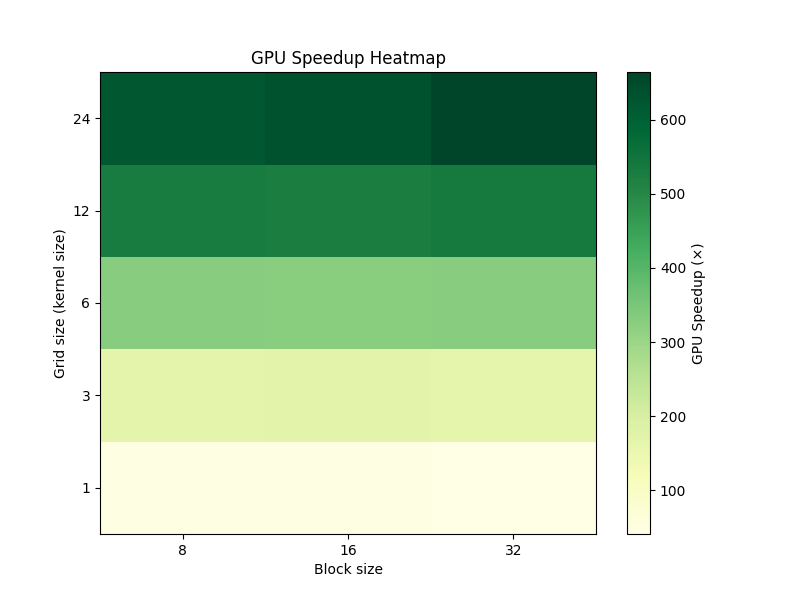
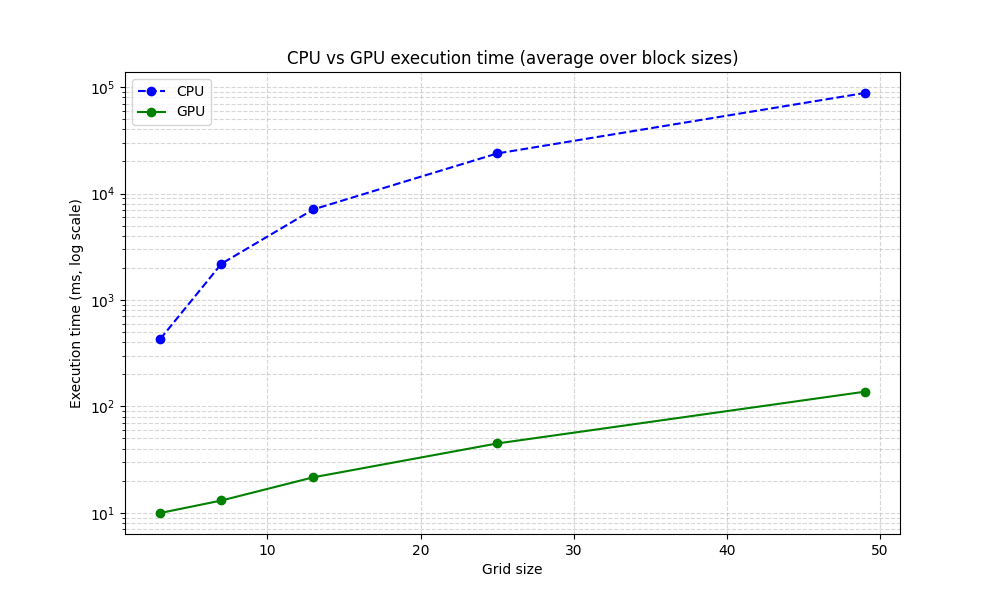
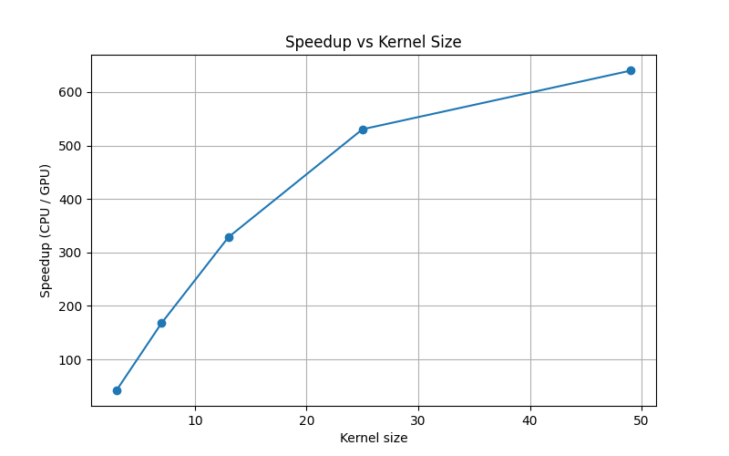

# 2D-Image-Filtering-CUDA

  

# Box Blur

3 channel input png image 

The blur used in this script is called a box blur, which computes each output pixel from the average of neigboring pixels of the base image, its intensity is define by a blur radius or kernel size of size $NxN$ defined as:

Kernel size\
$(2*grid + 1) x (2*grid + 1)$

Where grid is the distance from the center pixel to the furthest pixel from it, for example; 

$grid = 1 , 3x3\  kernel$ \
$grid = 3 , 5x5\  kernel$ 

This algorithm is of $O(n)^2$ complexity so the execution time grows quadratically with as the blur radius increases

# GPU Acceleration

In order to ease the computational load parallelism and shared memory optimization

## Paralelism

## Shared Memory
Each thread reads $(2*grid+1)^2$
## Tiles

## Zero Padding

# Benchmark

end-to-end blocking GPU pipeline vs CPU loop

  
| Kernel Size  | Block Size  | Avg CPU (ms) ± | Avg GPU (ms) ± | Speedup (×) |
|--------------|-------------|----------------|----------------|--------------|
| **3×3**      | 8           | 434.009 ± 6.409 | 9.807 ± 0.165 | 44.256 |
|              | 16          | 429.104 ± 7.776 | 9.667 ± 0.185 | 44.387 |
|              | 32          | 426.052 ± 5.282 | 10.443 ± 0.396 | 40.796 |
| **7×7**      | 8           | 2135.579 ± 4.052 | 12.762 ± 0.098 | 167.335 |
|              | 16          | 2296.975 ± 50.580 | 13.421 ± 1.429 | 171.146 |
|              | 32          | 2144.785 ± 10.463 | 13.027 ± 0.249 | 164.645 |
| **13×13**    | 8           | 6837.037 ± 59.215 | 20.714 ± 1.545 | 330.074 |
|              | 16          | 7558.428 ± 281.267 | 23.118 ± 1.987 | 326.953 |
|              | 32          | 6892.799 ± 79.062 | 20.913 ± 0.403 | 329.586 |
| **25×25**    | 8           | 23520.955 ± 102.642 | 44.291 ± 2.922 | 531.053 |
|              | 16          | 23459.219 ± 202.633 | 44.772 ± 4.124 | 523.976 |
|              | 32          | 24426.783 ± 925.864 | 45.577 ± 4.426 | 535.941 |
| **49×49**    | 8           | 88621.828 ± 1720.532 | 142.777 ± 1.371 | 620.699 |
|              | 16          | 86137.703 ± 1458.251 | 135.484 ± 1.478 | 635.775 |
|              | 32          | 89228.289 ± 2671.449 | 134.277 ± 1.595 | 664.507 |

  

  

  

